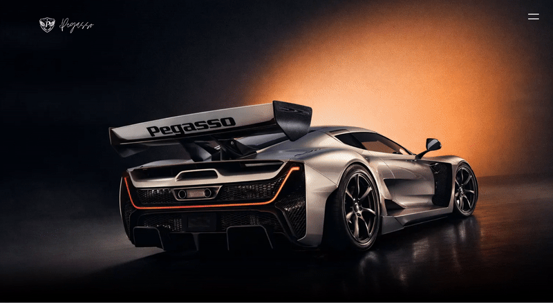
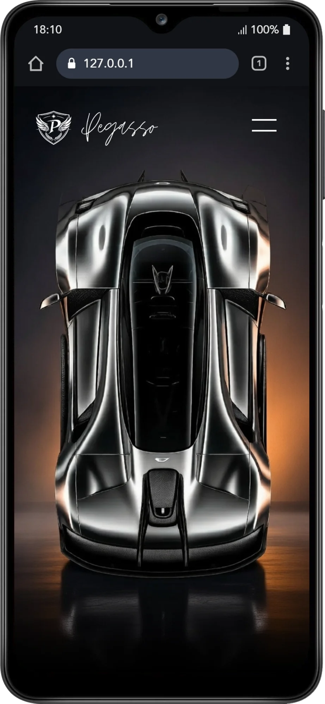

<h1 align="center">🏎️ Pegasso High Luxury Car Web</h1>

  This project was developed as part of my first year <b>Web Application Development Degree (DAW)</b> studies. All the interface design, layout structure, and visual composition were created by me from scratch.

  

  

## 💎 Technical Breakdown (What I applied)

* **CSS-Based Menu:** I designed a functional menu using CSS `checkbox` logic as a core. While the foundation is pure CSS, I integrated a small amount of **JavaScript** to handle menu closing more smoothly, learning how to combine both tools effectively.
* **Layout & Layering:** I practiced using `z-index` layers and CSS masks (`mask-image`) to create gradient effects directly on images without needing external editing.
* **3D Interactions:** I implemented Z-axis transforms on the product cards. My goal was to understand how perspectives and pseudo-elements (`::before`, `::after`) work together to create visual depth.
* **Fluidity:** I focused on making transitions as lightweight as possible by using properties like `transform` and `scale`, which the browser processes more efficiently to ensure a smoother experience.
* **HTML5 & CSS3:** Focused on writing clean, semantic markup. I used **Flexbox** and **CSS Grid** to practice building responsive layouts.

---

### ⚠️
Most of the photographic assets and AI prompts used in this project are based on the **Czinger 21C** hypercar. This project is for educational and portfolio purposes only.

---
Developed by **valerodev** | 2026
